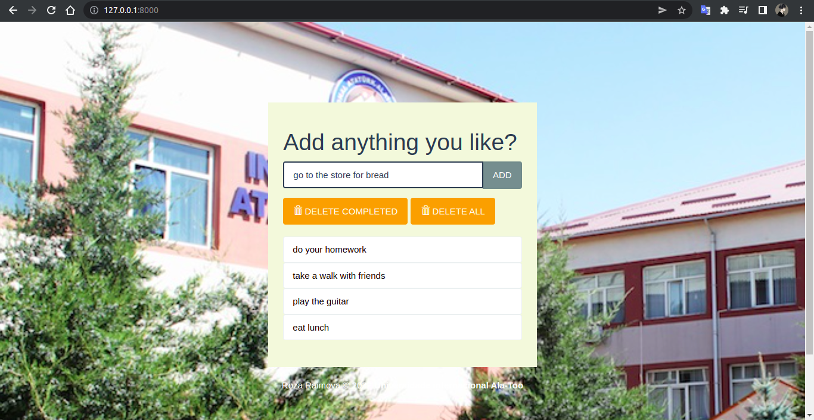
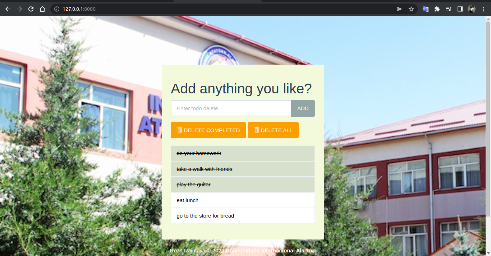
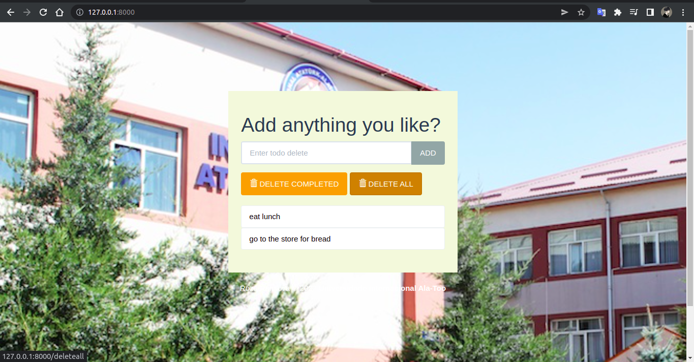

### Hello everyone, this is a simple todo list, the logic is simple, everyone can add tasks and execute it. Django 4 was used for this project 

### On this one-page site, you can write tasks, highlight and delete, and there is also a delete all entries button
# Additions


# Mark completed


# Delete marked


# Delete all



### To use the code you need (Linux):

<h3>1. Сreate a virtual environment: </h3>
``` 
virtualenv venv 
```
<h3>2. Active your virtual environment: </h3>
```
source venv/bin/activate
```
<h3>3. Install all dependencies </h3>
```
pip install -r requirements.txt
```
<h3>4. Conduct migrations </h3>
```
python manage.py migrate
```
<h3>5. Run the program </h3>
```
python manage.py runserver
```